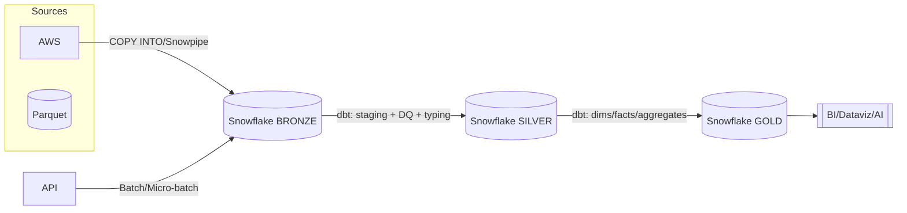

---

# Medallion Architecture on Snowflake with dbt (Bronze → Silver → Gold)

End-to-end analytics stack implementing the **Medallion architecture** on **Snowflake**, with **dbt** for transformations, testing, documentation, and CI/CD.
Raw data lands in **Bronze**, is cleaned/conformed in **Silver**, and is modeled into **analytics-ready marts** in **Gold**.

---

## Architecture



* **Bronze**: raw landing tables (append-only, minimal parsing)
* **Silver**: cleaned, typed, deduplicated, business-conformed
* **Gold**: star/snowflake marts, aggregates, semantic views

---

## Tech Stack

* **Warehouse**: Snowflake (Database/Schemas/Warehouse/Role)
* **Transformations**: dbt Core + `dbt-snowflake` adapter
* **Data Quality**: dbt tests (generic + singular)
* **Ingestion (examples)**: Snowpipe / COPY INTO / external stage
* **CI/CD**: GitHub Actions (or dbt Cloud)
* **Orchestration (optional)**: Airflow/Astronomer, Snowflake Tasks/Streams

---

## Repo Structure

```bash
.
├─ dbt/                         # dbt project root
│  ├─ models/
│  │  ├─ bronze/                # raw landing models (optional views)
│  │  │  └─ sources.yml         # source declarations (raw tables/stages)
│  │  ├─ silver/                # staging/cleaning/typing/dedup
│  │  │  ├─ stg_orders.sql
│  │  │  └─ schema.yml          # tests + docs for silver models
│  │  └─ gold/                  # dims/facts/marts
│  │     ├─ dim_customers.sql
│  │     ├─ fact_orders.sql
│  │     └─ schema.yml          # tests + docs for gold models
│  ├─ snapshots/                # optional CDC snapshots
│  ├─ seeds/                    # small lookup CSVs -> seed tables
│  ├─ macros/                   # custom macros (generic tests, utils)
│  ├─ analyses/                 # ad hoc, non-deployed SQL
│  ├─ tests/                    # singular tests (.sql assertions)
│  ├─ dbt_project.yml
│  └─ README.md
├─ .github/workflows/ci.yml     # dbt build in CI
├─ .env.example                 # env var template (no secrets)
├─ requirements.txt             # dbt-snowflake, dbt-core etc.
└─ .gitignore
```

---

## Snowflake Prerequisites

Create (or use) the following in Snowflake:

* **Role**: e.g., `TRANSFORMER_ROLE`
* **Warehouse**: e.g., `COMPUTE_WH`
* **Database**: e.g., `ANALYTICS`
* **Schemas**: `BRONZE`, `SILVER`, `GOLD` (one DB with three schemas is common)

Example (run as account admin or appropriate role):

```sql
CREATE ROLE IF NOT EXISTS TRANSFORMER_ROLE;
GRANT ROLE TRANSFORMER_ROLE TO USER <YOUR_USER>;

CREATE WAREHOUSE IF NOT EXISTS COMPUTE_WH
  WAREHOUSE_SIZE = XSMALL
  AUTO_SUSPEND = 60
  AUTO_RESUME = TRUE;

CREATE DATABASE IF NOT EXISTS ANALYTICS;

CREATE SCHEMA IF NOT EXISTS ANALYTICS.BRONZE;
CREATE SCHEMA IF NOT EXISTS ANALYTICS.SILVER;
CREATE SCHEMA IF NOT EXISTS ANALYTICS.GOLD;

GRANT USAGE ON WAREHOUSE COMPUTE_WH TO ROLE TRANSFORMER_ROLE;
GRANT USAGE ON DATABASE ANALYTICS TO ROLE TRANSFORMER_ROLE;
GRANT USAGE ON SCHEMA ANALYTICS.BRONZE TO ROLE TRANSFORMER_ROLE;
GRANT USAGE ON SCHEMA ANALYTICS.SILVER TO ROLE TRANSFORMER_ROLE;
GRANT USAGE ON SCHEMA ANALYTICS.GOLD  TO ROLE TRANSFORMER_ROLE;
GRANT SELECT, INSERT, UPDATE, DELETE, CREATE TABLE, CREATE VIEW
  ON ALL SCHEMAS IN DATABASE ANALYTICS TO ROLE TRANSFORMER_ROLE;
```

---

## Local Setup

1. **Clone & install**

   ```bash
   python -m venv .venv && source .venv/bin/activate   # (Windows: .venv\Scripts\activate)
   pip install -r requirements.txt
   ```

2. **dbt profile** (`~/.dbt/profiles.yml`)

   ```yaml
   snowflake_project:
     target: dev
     outputs:
       dev:
         type: snowflake
         account: "{{ env_var('SNOWFLAKE_ACCOUNT') }}"
         user: "{{ env_var('SNOWFLAKE_USER') }}"
         password: "{{ env_var('SNOWFLAKE_PASSWORD') }}"
         role: "{{ env_var('SNOWFLAKE_ROLE', 'TRANSFORMER_ROLE') }}"
         warehouse: "{{ env_var('SNOWFLAKE_WAREHOUSE', 'COMPUTE_WH') }}"
         database: "{{ env_var('SNOWFLAKE_DATABASE', 'ANALYTICS') }}"
         schema: "{{ env_var('SNOWFLAKE_SCHEMA', 'SILVER') }}"   # build default schema
         client_session_keep_alive: False
         threads: 4
   ```

   Add a `.env` (don’t commit secrets):

   ```env
   SNOWFLAKE_ACCOUNT=abc-xy123
   SNOWFLAKE_USER=your_user
   SNOWFLAKE_PASSWORD=********
   SNOWFLAKE_ROLE=TRANSFORMER_ROLE
   SNOWFLAKE_WAREHOUSE=COMPUTE_WH
   SNOWFLAKE_DATABASE=ANALYTICS
   SNOWFLAKE_SCHEMA=SILVER
   ```

3. **Project config** (`dbt/dbt_project.yml`)

   ```yaml
   name: 'snowflake_medallion'
   version: '1.0.0'
   profile: 'snowflake_project'

   models:
     snowflake_medallion:
       +materialized: view
       bronze:
         +schema: BRONZE
         +materialized: table
       silver:
         +schema: SILVER
         +materialized: incremental
         +on_schema_change: append_new_columns
         +incremental_strategy: merge
         +unique_key: order_id
       gold:
         +schema: GOLD
         +materialized: table
   ```

---

## Ingestion (Bronze)

**Option A — COPY INTO (batch)**

```sql
CREATE STAGE IF NOT EXISTS ANALYTICS.BRONZE.raw_stage
  URL='s3://<bucket>/raw/orders'
  CREDENTIALS=(AWS_KEY_ID='<id>' AWS_SECRET_KEY='<secret>')
  FILE_FORMAT=(TYPE=JSON STRIP_OUTER_ARRAY=TRUE);

CREATE OR REPLACE TABLE ANALYTICS.BRONZE.orders_raw (v VARIANT);

COPY INTO ANALYTICS.BRONZE.orders_raw
  FROM @ANALYTICS.BRONZE.raw_stage
  FILE_FORMAT=(TYPE=JSON STRIP_OUTER_ARRAY=TRUE)
  ON_ERROR='CONTINUE';
```

**Option B — Snowpipe (near-real-time)**
Create a pipe on the stage with an event notification (S3 event → SNS/SQS → Snowpipe). Then Bronze is automatically appended.

> In dbt, Bronze models can be pass-through views or light transforms referencing `source()` objects declared in `models/bronze/sources.yml`.

---

## Silver (Cleaning / Conformance)

Example **staging** model (`dbt/models/silver/stg_orders.sql`):

```sql
{{ config(
    materialized='incremental',
    unique_key='order_id',
    incremental_strategy='merge'
) }}

with src as (
  select
    v:order_id::string      as order_id,
    to_timestamp_ntz(v:order_datetime) as order_ts,
    v:customer_id::string   as customer_id,
    v:status::string        as order_status,
    v:items                 as items
  from {{ source('bronze', 'orders_raw') }}
),

dedup as (
  select *, row_number() over (partition by order_id order by order_ts desc) as rn
  from src
)

select
  order_id,
  order_ts,
  customer_id,
  order_status,
  items
from dedup
where rn = 1


  and order_ts > (select coalesce(max(order_ts), '1900-01-01') from {{ this }})

```

**Tests & docs** (`dbt/models/silver/schema.yml`):

```yaml
version: 2

sources:
  - name: bronze
    database: ANALYTICS
    schema: BRONZE
    tables:
      - name: orders_raw

models:
  - name: stg_orders
    description: "Cleaned & deduplicated orders"
    columns:
      - name: order_id
        tests: [not_null, unique]
      - name: order_status
        tests:
          - accepted_values:
              values: ['NEW','PENDING','SHIPPED','CANCELLED','RETURNED']
```

---

## Gold (Marts)

Example **dim/fact**:

```sql
-- dbt/models/gold/dim_customers.sql
select distinct
  c.customer_id,
  c.first_name,
  c.last_name,
  c.email,
  c.country
from {{ ref('stg_customers') }} c;
```

```sql
-- dbt/models/gold/fact_orders.sql
select
  o.order_id,
  o.customer_id,
  date(o.order_ts) as order_date,
  o.order_status,
  sum(oi.quantity * oi.unit_price) as order_amount
from {{ ref('stg_orders') }} o
join {{ ref('stg_order_items') }} oi on o.order_id = oi.order_id
group by 1,2,3,4;
```

---

## Run dbt

```bash
# verify connection
dbt --project-dir dbt debug

# pull packages (if any)
dbt --project-dir dbt deps

# seeds (lookups)
dbt --project-dir dbt seed

# build everything (models + tests + docs artifacts)
dbt --project-dir dbt build

# or run layer-by-layer
dbt --project-dir dbt run --select path:models/silver
dbt --project-dir dbt test --select path:models/silver

dbt --project-dir dbt run --select path:models/gold
dbt --project-dir dbt test --select path:models/gold

# docs
dbt --project-dir dbt docs generate
dbt --project-dir dbt docs serve
```

---

## Data Quality

* **Generic tests**: `not_null`, `unique`, `accepted_values`, `relationships`
* **Singular tests**: custom SQL assertions in `tests/`
* **Snapshots**: slowly changing dims (SCD2) in `snapshots/`
* **Exposures**: document BI dashboards or ML models that depend on Gold

---

## CI/CD (GitHub Actions)

`.github/workflows/ci.yml`:

```yaml
name: dbt-ci
on:
  push:
    branches: [ main ]
  pull_request:

jobs:
  build:
    runs-on: ubuntu-latest
    env:
      SNOWFLAKE_ACCOUNT: ${{ secrets.SNOWFLAKE_ACCOUNT }}
      SNOWFLAKE_USER: ${{ secrets.SNOWFLAKE_USER }}
      SNOWFLAKE_PASSWORD: ${{ secrets.SNOWFLAKE_PASSWORD }}
      SNOWFLAKE_ROLE: ${{ secrets.SNOWFLAKE_ROLE }}
      SNOWFLAKE_WAREHOUSE: ${{ secrets.SNOWFLAKE_WAREHOUSE }}
      SNOWFLAKE_DATABASE: ${{ secrets.SNOWFLAKE_DATABASE }}
      SNOWFLAKE_SCHEMA: ${{ secrets.SNOWFLAKE_SCHEMA }}
    steps:
      - uses: actions/checkout@v4
      - uses: actions/setup-python@v5
        with: { python-version: "3.10" }
      - run: pip install -r requirements.txt
      - run: dbt --project-dir dbt deps
      - run: dbt --project-dir dbt build --target dev
```

> Add secrets in **Repo Settings → Secrets and variables → Actions**.

---

## Performance & Cost

* **Warehouse sizing**: start XSMALL + auto suspend/resume
* Prefer **incremental** materializations in Silver/Gold
* Use **`unique_key` + `merge`** for idempotent upserts
* Consider **clustering keys** on large tables w/ skewed filters
* Partition-friendly designs (dates) for prune-able queries
* Archive old Bronze to cheaper storage if needed

---

## Security & Governance

* Use a **least-privilege role** for dbt (`TRANSFORMER_ROLE`)
* Store creds in **env/Secrets** (never commit `profiles.yml` with passwords)
* Optional: **Row/Column-level security** for sensitive Gold tables
* Document exposures for lineage & auditability (`dbt docs`)

---

## Local Development Tips

* Switch default schema per developer (e.g., `SNOWFLAKE_SCHEMA=DEV_<initials>`)
* Use `dbt build --select <model>+` to include parents/children
* `dbt run --full-refresh` sparingly (expensive!)

---

## .gitignore (recommended)

```
# dbt
dbt/target/
dbt/logs/
dbt/packages/
dbt/manifest.json
dbt/run_results.json

# env
.env
.env.*
profiles.yml

# OS/IDE
.DS_Store
.vscode/
.idea/
```

---

## License

MIT (or your org’s preferred license)

---

## Contributing

PRs welcome. Please:

1. open an issue first,
2. keep models documented & tested,
3. add/adjust CI where needed.

---

